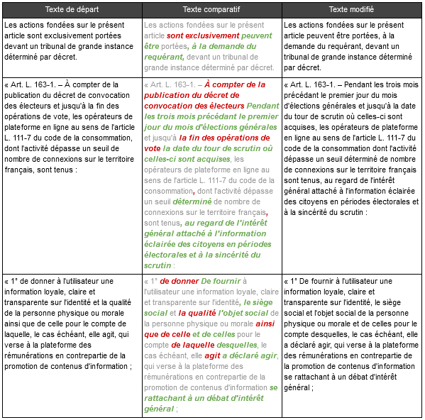

# Retrieve law drafts and compare them

## Principles

*This repository is part of a wider study about french legislative processes.*

Legal documents can be a headache: tons of pages of jargon considerations. From a digital social sciences perspective, we could help ourselves a bit on those matters.

Therefore, this project has two main and consecutive sides:

- Scrap data from the web
- Visualize data correctly

A sister project of the present one can be found [here](https://github.com/Tayflo/gas-scrapLegifrance-discriminate).

## Description

The idea of the present project is to highlight evolutions between very similar texts, such as consecutive drafts of the same law.

Using a ["longest common subsequence" algorithm](https://en.wikipedia.org/wiki/Longest_common_subsequence_problem#Code_for_the_dynamic_programming_solution), we retrieve all the words that have changed between a version and another.

We obtain the following results:

  

## License and Re-use

This personal project was part of a broader specific work, hence it has not been designed for easy straightforward re-use, neither for further developments.

- If it can ever serve educational purposes as it is, it's great.

- If you plan to draw inspiration from the present work and its methods, citation in your own work is always appreciated. If needed, you can also open an issue or [contact me](tayflooooo@gmail.com).

- If you are interested in analyzing lawmaking, the GitHub organization [Regards Citoyens](https://github.com/regardscitoyens) could be the right place for you.

All underlying dependencies of the project can be found in [package.json](package.json), and when needed references are within the source code.
